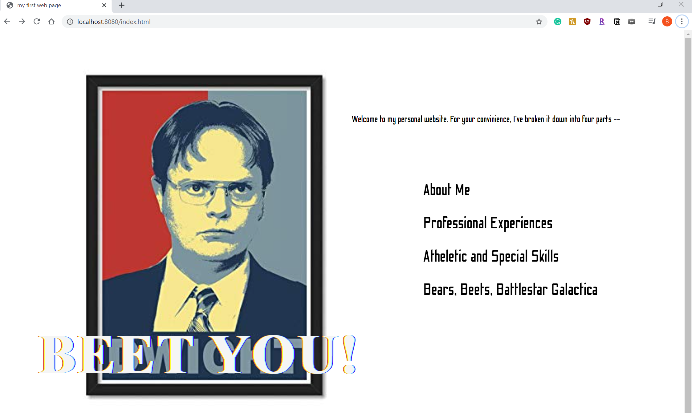
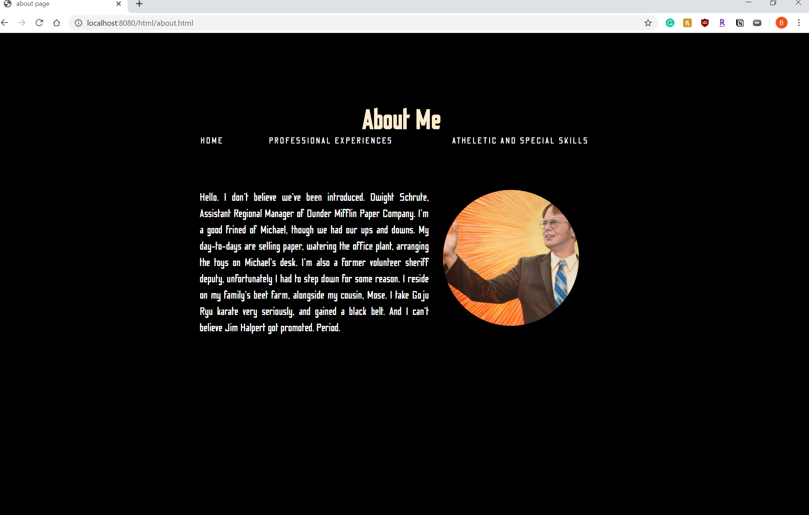
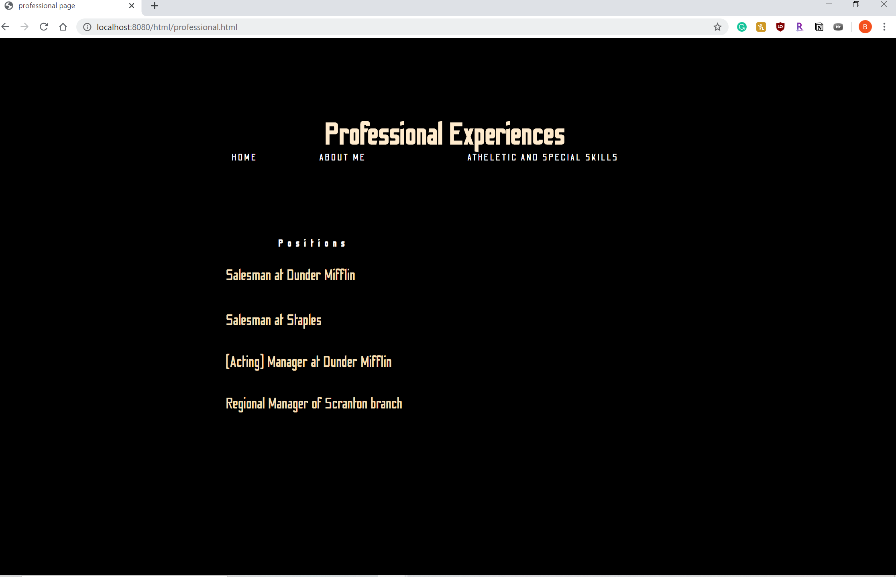
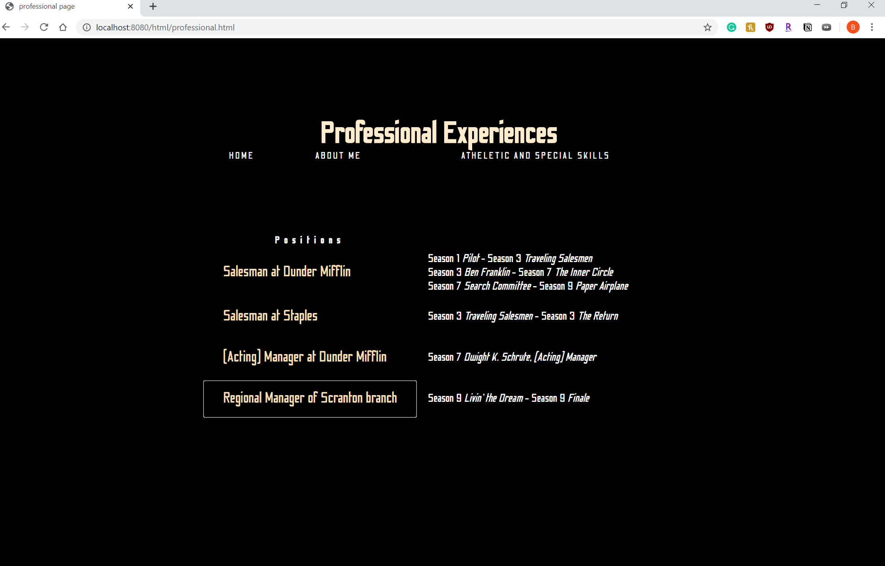
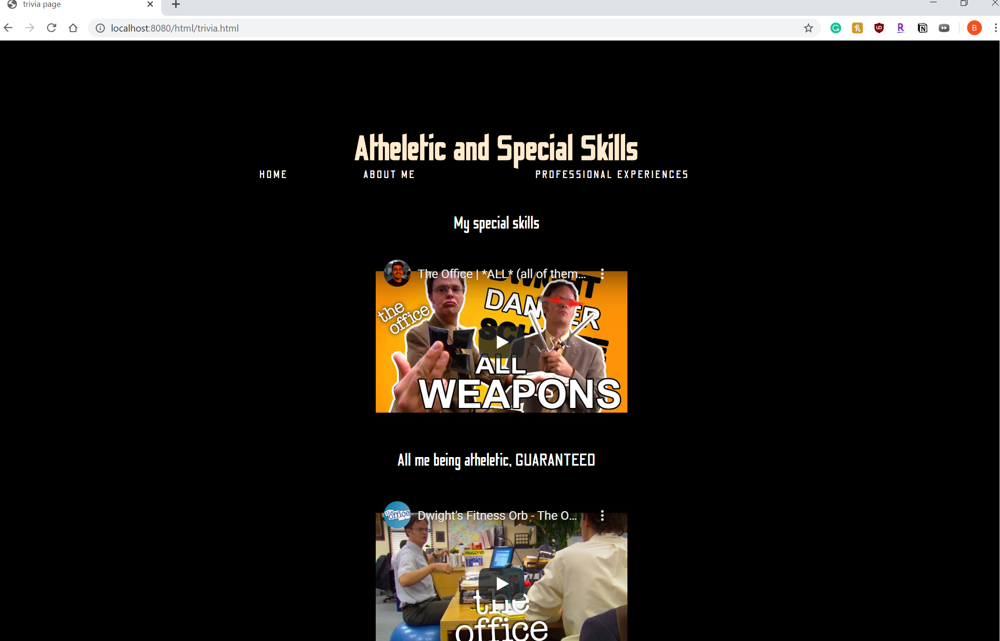

# PersonalWebsite-WenbeiZheng

[deployed webpage heroku link](https://beet-farm.herokuapp.com/)

### The website is acting as a personal website for Dwight Schrute, a character from The Office. It briefly introduces Dwight about his career path and hobbies.

    
landing page

- This page includes 3 animated components by using css, a block element of unordered listings, an external link in a new tab attached with "Bears, Beets, Battlestar Galactica" listing, and 3 internal links to other pages in the same window. 

- Interactive/animated components:
    1. the heading "BEET YOU!" uses blink animation
    2. the brief intro uses typewritter effect (would be more vivid if pause more seconds after each period)
    3. the navbar listings display underlines when hover on them

    
"about me" page

- This page simply consists of a rounded image and a paragraph. I was trying to make the text wrap the image by using shape-outside: circle(), but it didn't work. I assume it's about div layer?

    
"professional experiences" page

- This page contains a html table with buttons inside each row cell and 2 interactive/animated elements by applying jQuery. When the cursor is hovering on the buttons, the cursor will change to a pointer shape and the background color will change to a different one, plus a callback function to change the color back to black; when you click each button, the according text will appear on the right. 

    
"atheletic and special skills" page

- This page simply consists of embedded YouTube videos link by using iframe tag.

    
miscellaneous

- Font used in all the pages are applying css @font-face rule

